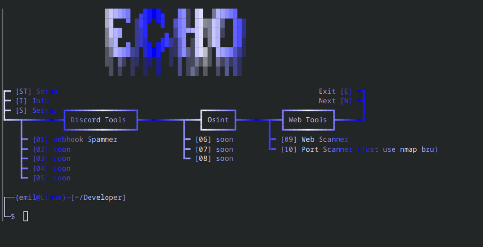

# ECHO -- A MULTI TOOL WRITTEN IN PYTHON
Echo is used for a wide range of uses like a swiss army knife

im open to people helping with the development of the project and if you would like to request something to be added please dm me on discord!
discord: sxlar_.

any bugs report them to me on discord!

thats all!


# NOT TESTED ON WINDOWS FOR BUGS


EASY SETUP:
```bash
git clone https://github.com/sxlar333/Echo.git
cd Echo
./setup.sh
```
